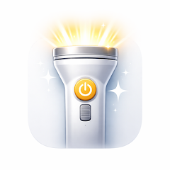

  

<h1 align="center">OneTap — Latarka i SOS</h1>

  <b>Natychmiastowa latarka offline. Jeden tap, światło w mniej niż 300 ms. SOS, stroboskop, timer wyłączania i widget. Bez reklam, bez Internetu, bez śledzenia.</b>

  
  

  
  
  
  
  
  

  <b>Języki:</b>
  <a href="README.md">English</a> · <a href="README.es.md">Español</a> · <a href="README.pt-BR.md">Português</a> · <a href="README.de.md">Deutsch</a> · <a href="README.fr.md">Français</a> · <a href="README.it.md">Italiano</a> · <a href="README.nl.md">Nederlands</a> · <a href="README.cs.md">Čeština</a> · <a href="README.uk.md">Українська</a> · <a href="README.ru.md">Русский</a> · <a href="README.tr.md">Türkçe</a> · <a href="README.ar.md">العربية</a> · <a href="README.hi.md">हिन्दी</a> · <a href="README.zh-CN.md">中文</a> · <a href="README.ja.md">日本語</a> · <a href="README.ko.md">한국어</a> · <a href="README.id.md">Bahasa Indonesia</a> · <a href="README.vi.md">Tiếng Việt</a> · <a href="README.th.md">ภาษาไทย</a>

---

## Czym jest OneTap?

**OneTap** to natychmiastowa latarka, która nie staje na drodze. Jeden tap i światło włącza się w mniej niż 300 milisekund — bez ekranu powitalnego, bez ładowania, bez rejestracji. Dostępna na Androida i iPhone'a. OneTap robi to, co latarka powinna robić: szybko się włącza, świeci, ile trzeba, i równo gaśnie. Aplikacja zawiera sygnał SOS w alfabecie Morse'a, oddzielnie zabezpieczony tryb stroboskopowy, automatyczny timer wyłączania, widget na ekran główny oraz w Androidzie kafelek w Szybkich ustawieniach.

Jedna zasada: **latarka ma być latarką**. Zero reklam, zero połączenia z Internetem, zero analityki, zero okienek "oceń aplikację" o 3 w nocy, żadnych uprawnień poza dostępem do diody aparatu.

## Najważniejsze funkcje

### Natychmiastowe światło
- **Mniej niż 300 ms od tapnięcia do światła**
- **Dioda LED aparatu** dla maksymalnej jasności
- **Światło ekranu** w miękkiej bieli, ciepłej bieli lub czerwieni

### Sytuacje awaryjne
- **Sygnał SOS Morse'a** — międzynarodowy wzór `· · · — — — · · ·`
- **Tryb stroboskopu** — 1–20 Hz, celowo zabezpieczony długim naciśnięciem

### Wygoda
- **Automatyczny timer** — 2, 5, 10 lub 20 minut
- **Widget na ekranie głównym** — światło bez otwierania aplikacji
- **Kafelek Szybkich ustawień** (Android) — najszybszy dostęp

### Prywatność
- **Brak uprawnień do Internetu** — aplikacja nie może łączyć się z siecią
- **Bez analityki, bez śledzenia**
- **Bez reklam, bez zakupów, bez subskrypcji**
- **Wysoki kontrast** dla obsługi jedną ręką

## Zastosowania

| Sytuacja | Co robi OneTap |
|----------|---------------|
| Awaria prądu | Tap w widget — dioda w mniej niż 300 ms |
| Czytanie nocą | Czerwone światło ekranu, bez przeszkadzania innym |
| Biwak w namiocie | Ciepłe białe światło ekranu |
| Spacer z psem | LED z automatycznym wyłączeniem |
| Awaria na drodze | Międzynarodowy SOS w Morse |
| Praca pod meblem | LED z automatycznym wyłączeniem |
| Koncerty | Stroboskop z celową aktywacją |
| Lampka nocna dla dziecka | Ciepłe światło ekranu o niskiej jasności |

## Jak to działa

**Czemu tak szybko?**
Zero splash-screena, zero animacji, zero zapytań sieciowych, zero telemetrii. Aplikacja startuje od razu na ekranie latarki.

**Naprawdę offline?**
Tak. OneTap nawet nie prosi o uprawnienie do Internetu.

**Jak wygląda SOS?**
Międzynarodowy SOS w Morse — trzy krótkie, trzy długie, trzy krótkie — w rozpoznawalnym rytmie.

**Czemu stroboskop wymaga długiego naciśnięcia?**
Migające światło może być niebezpieczne dla osób z padaczką światłoczułą. Aktywacja musi być świadoma.

## Pobieranie

| Platforma | Sklep | Identyfikator |
|-----------|-------|---------------|
| Android | [Google Play](https://play.google.com/store/apps/details?id=com.tomas.onetap_light) | `com.tomas.onetap_light` |
| iOS | [App Store](https://apps.apple.com/us/app/onetap-flashlight-sos/id6760909926) | `id6760909926` |

**Wsparcie:** [github.com/Lapnito/onetap-flashlight/issues](https://github.com/Lapnito/onetap-flashlight/issues)

## Najczęstsze pytania

**Aplikacja jest naprawdę darmowa?**
Tak. Bez reklam, zakupów i subskrypcji.

**Jakie uprawnienia są potrzebne?**
Na Androidzie tylko dostęp do aparatu (do diody). Na iOS systemowe API latarki. Nic więcej.

**Czy zbiera dane?**
Nie. Bez uprawnień do Internetu, bez analityki, bez SDK osób trzecich.

**Czy timer chroni baterię?**
Tak. LED zużywa prąd, nawet gdy o tym nie myślisz — automatyczne wyłączenie chroni przed zostawieniem światła włączonego.

**Czy nadaje się jako lampka nocna?**
Tak. Czerwone albo ciepłe światło ekranu o niskiej jasności, timer 20 minut.

**Jak szybko naprawdę?**
Mniej niż 300 ms od uruchomienia do zapalenia diody na typowym sprzęcie. Widget i kafelek są jeszcze szybsze.

**Czemu stroboskop oddzielnie?**
Dla bezpieczeństwa osób z padaczką światłoczułą.

**Czy działa na tabletach?**
Tak — tablety bez diody mają tylko tryby światła ekranu.

**Czy SOS to prawdziwy Morse?**
Tak. Międzynarodowy wzorzec — trzy krótkie, trzy długie, trzy krótkie.

**Jak zgłosić błąd?**
Otwórz issue na [github.com/Lapnito/onetap-flashlight/issues](https://github.com/Lapnito/onetap-flashlight/issues) lub napisz na tom@lapnito.cz.

## Technologia

- **Framework:** Flutter (Android i iOS)
- **Sensory:** Dioda LED aparatu (tryb torch)
- **Sieć:** Brak — aplikacja nie prosi o uprawnienie do Internetu
- **Minimalny Android:** Android 6.0 (API 23)
- **Minimalny iOS:** iOS 14.0
- **Języki tego README:** English, Español, Português, Deutsch, Français, Italiano, Nederlands, Polski, Čeština, Українська, Русский, Türkçe, العربية, हिन्दी, 中文, 日本語, 한국어, Bahasa Indonesia, Tiếng Việt, ภาษาไทย

## O deweloperze

OneTap tworzy **lapnito.cz s.r.o.** (Lapnito Development Studio) — czeskie studio, które publikuje małe, skupione, wolne od reklam narzędzia.

- **Wsparcie:** [github.com/Lapnito/onetap-flashlight/issues](https://github.com/Lapnito/onetap-flashlight/issues)
- **E-mail:** tom@lapnito.cz
- **Więcej aplikacji w Google Play:** [Lapnito Development Studio](https://play.google.com/store/apps/dev?id=8923575656207320763)
- **Więcej aplikacji w App Store:** [lapnito.cz s.r.o.](https://apps.apple.com/us/developer/lapnito-cz-s-r-o/id1577358577)

---

Stworzone z ❤️ w Czechach przez <a href="https://github.com/Lapnito">lapnito.cz s.r.o.</a>

